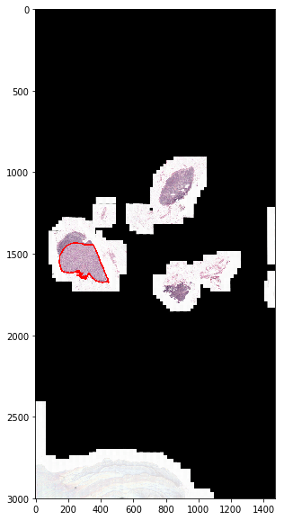
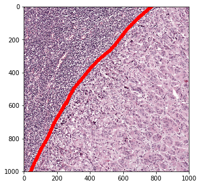
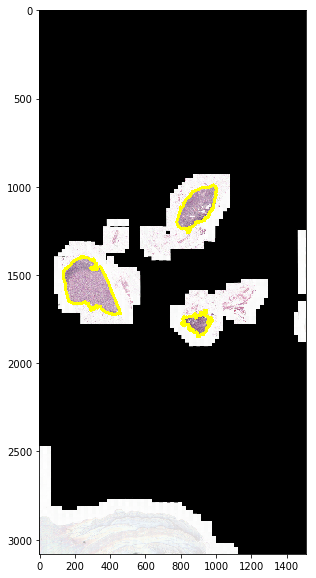
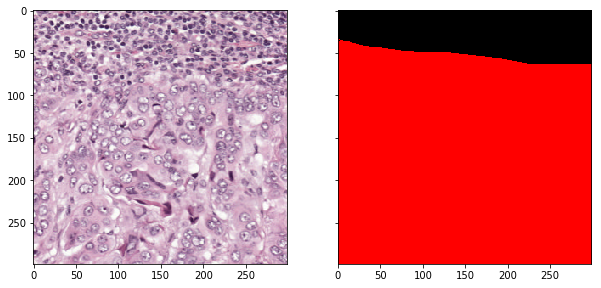

Quick introduction
==================

**wsipre** has two main modules (see :ref:`modindex` for docs):

    * ``slide``: load and process WSIs
    * ``show``: visualize images generated using ``slide``

The following quick intro illustrates basic usage of these modules. First, load
packages (Matplotlib is only used here to plot images with no annotation). ::

    >>> from matplotlib import pyplot as plt
    >>> from wsipre import slide, show

Load WSI with its region-level tumor annotation. ::

    >>> wsi = slide.Slide(filename='patient_012_node_0.tif',
                          annotation_filename='patient_012_node_0.xml',
                          data_source='camelyon')

Generate and show a thumbnail. ::

    >>> thumbnail, mask, downsampling_factor = wsi.get_thumbnail_with_annotation(
            size=(3000, 3000), polygon_type='line', line_thickness=8)
    
    >>> black = (0, 0, 0)
    >>> red = (1, 0, 0)
    >>> yellow = (1, 1, 0)
    >>> colors = {0: black, 1: black, 2: red}

    >>> fig = show.Figure(image=thumbnail, annotation=mask, color_map=colors)
    >>> fig.show_image_with_annotation(split=False)

Zoom in and read a smaller region from the WSI. ::

    >>> loc = (int(150*downsampling_factor), int(1450*downsampling_factor))

    >>> slide_region, mask_region = wsi.read_region_with_annotation(
             location=loc, level=2, size=(1000, 1000), polygon_type='line',
             line_thickness=20)

    >>> fig = show.Figure(
            image=slide_region, annotation=mask_region, color_map=colors)
    >>> fig.show_image_with_annotation(split=False)

Locate tissue regions in the WSI automatically. ::

    >>> wsi.get_tissue_mask(polygon_type='line', line_thickness=15)
    Slide('patient_012_node_0.tif')

    >>> fig = show.Figure(image=wsi.downsampled_slide,
                          annotation=wsi.tissue_mask,
                          color_map={0: black, 1: yellow})
    >>> fig.show_image_with_annotation(split=False)

Sample a random patch from tissue regions. ::

    >>> tissue_patch = wsi.read_random_tissue_patch(level=2, size=(224, 224)) 
    >>> plt.imshow(tissue_patch)
    >>> plt.show()

.. image:: ../img/random_patch.png 
   :scale: 70 %
   :align: center 

Sample a random patch from regions annotated as tumor (label 2). ::

    >>> slide_region, mask_region = wsi.read_random_patch(
            level=2, size=(299, 299), target_class=2,
            min_class_area_ratio=0.75, polygon_type='area')

    >>> fig = show.Figure(slide_region, mask_region, {0: black, 2:red})

    >>> fig.show_image_with_annotation(split=True) 

Double check the mapping between class label and color. ::

    >>> fig.show_label_colors()

    

